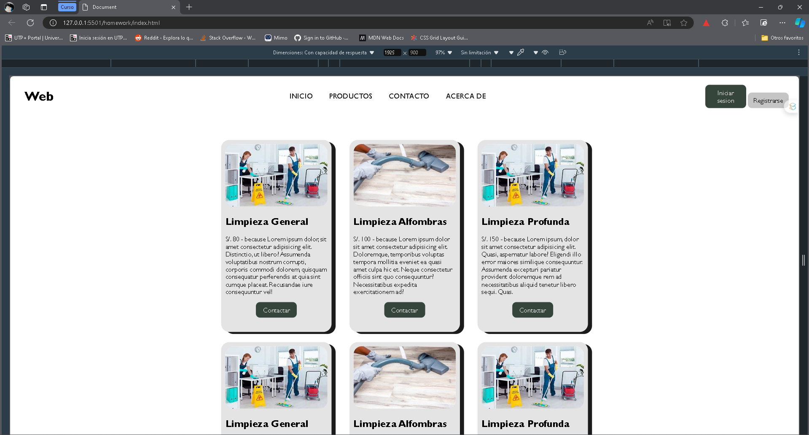
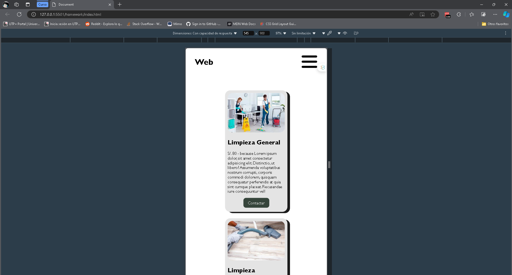

# Proyecto de Servicios de Limpieza

Este proyecto es un sitio web que ofrece servicios de limpieza. Utiliza Sass para una mejor organización del código CSS y emplea un diseño modular.

### Variables de Color
- **`$text-color`**: Color del texto principal del sitio.
- **`$bg-primary`**: Color de fondo para el botón primario.
- **`$bg-primary-hover`**: Color de fondo cuando el botón primario es hover.
- **`$bg-secondary`**: Color de fondo para el botón secundario.
- **`$bg-secondary-hover`**: Color de fondo cuando el botón secundario es hover.
- **`$bg-card`**: Color de fondo para las tarjetas de servicio.

### Variables de Tipografía
- **`$font-family-base`**: Tipografía base utilizada en todo el sitio.
- **`$font-size-large`**: Tamaño de fuente para elementos grandes (títulos).
- **`$font-size-small`**: Tamaño de fuente para textos pequeños.

### Variables de Espaciado y Bordes
- **`$padding`**: Espaciado uniforme para los elementos.
- **`$border-radius`**: Radio de los bordes aplicados a botones y tarjetas.
- **`$transition-time`**: Tiempo de transición para las animaciones.

## Funciones utilizadas

### transition

- La propiedad transition permite crear efectos de transición suaves entre diferentes estados de un elemento. Se utiliza en botones y tarjetas para mejorar la experiencia del usuario al interactuar con ellos.

```scss
.btn {
    transition: all 0.2s ease-in;
}

.card {
    transition: all 0.2s ease-in;
}
```

### transform

- La propiedad transform permite aplicar transformaciones 2D y 3D a los elementos. En este proyecto, se utiliza para crear un efecto de "elevación" al pasar el mouse sobre las tarjetas.

```scss
.card:hover {
    transform: translate(0, -30px);
}
```

### flex

- El modelo de caja flexible (flexbox) es utilizado para crear layouts más eficientes y responsivos. Se usa para alinear y distribuir el espacio entre los elementos en contenedores flexibles.

```scss
.section-cards {
    display: flex;
    flex-wrap: wrap;
    justify-content: space-evenly;
    align-items: center;
    gap: 20px;
}
```

### box-shadow

- La propiedad box-shadow añade sombras alrededor de un elemento, lo que proporciona profundidad y mejora la apariencia visual. Se usa en las tarjetas para darles un efecto de elevación.

```scss
.card {
    box-shadow: 10px 10px 0 rgb(27, 27, 27);
}
```


## Responsive

## Vista en Escritorio


## Vista Mobile


### buttons
- Se utiliza para ocultar items y agregar icon 

```scss
  .btn-menu{
    display: none;
  }
```
### header
```scss
.nav {
    display: flex;
    justify-content: space-between;
    align-items: center;
    padding: 10px 25px;

    &-header {
        display: flex;
        justify-content: start;
        align-items: center;
        gap: 10px;
    }
    &-items {
        list-style: none;
        display: flex;
        align-items: center;
        gap: 10px;
    }
    &-link {
        text-decoration: none;
        font-size: large;
        color: #252525;
        padding: 15px;
        border-radius: 10px;
        transition: color 0.2s ease-in;
        text-transform: uppercase;

        &:hover {
            color: rgb(186, 185, 185);
        }
    }
}

/* Responsive navbar */
@media (min-width: 1870px) {
    .nav {
        gap: 50px;
    }
}

@media (max-width: 886px) {
    .nav-items {
        display: none;
    }
    .nav-btns {
        display: none;
    }
    .btn-menu {
        display: block;
    }
}
```


### main
```scss
.container {
    padding: $padding;
    position: relative;
    height: inherit;
    width: 50%;
    margin: 40px auto;
    flex: 1;

    .section {
        height: inherit;

        &-cards {
            display: flex;
            flex-wrap: wrap; /* Permitir que las cartas se envuelvan */
            justify-content: space-evenly;
            align-items: flex-start; /* Alinear al inicio */
            gap: 25px; /* Espacio entre las cartas */
        }
    }
}

/* Responsive */
@media (max-width: 886px) {
    .card {
        height: 470px;
        width: 300px; /* Ancho estándar para las cartas */
        border-radius: 20px;
        background-color: $bg-card;
        box-shadow: 10px 5px 0 rgb(27, 27, 27);
        transition: all $transition-time ease-in;

        img {
            width: 100%; /* Ancho completo */
            border-radius: 20px; /* Bordes redondeados en la imagen */
        }

        &-buttons {
            display: flex;
            justify-content: center; /* Centrar el botón */
            align-items: center;
        }

        &:hover {
            transform: translate(0, -30px);
        }
    }
}
```
